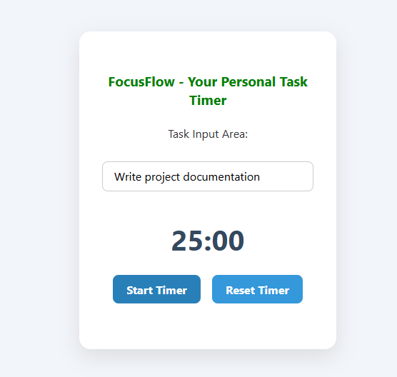
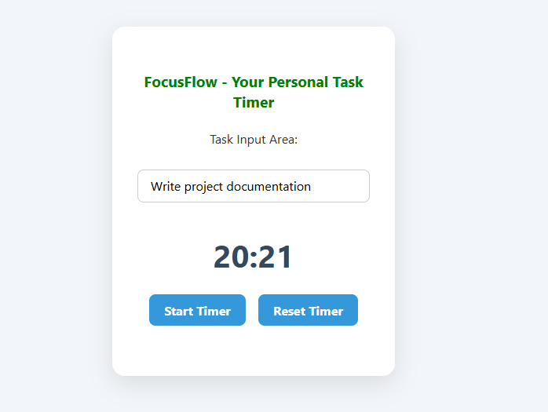

# ⏱️ FocusFlow - Task Timer

FocusFlow is a simple productivity app inspired by the Pomodoro Technique. It allows users to create tasks and work on them in focused 25-minute sessions. Once started, the timer counts down and helps users stay disciplined with their workflow.

🔗 [Live Demo](https://adeelh12.github.io/FocusFlow/)  
📂 [GitHub Repo](https://github.com/AdeelH12/FocusFlow)

---

## ✨ Features

- ➕ **Add Tasks**: Enter a task to focus on.  
- ⏳ **25-Minute Timer**: Countdown timer based on the Pomodoro technique.  
- ▶️ **Start & Track Progress**: Timer starts when a task is added.  
- 🔁 **Automatic Reset**: Timer resets when completed, ready for the next task.  
- 💾 **State Handling with Hooks**: Built using `useState` and `useEffect`.  
- 📱 **Responsive UI**: Works on both desktop and mobile devices.  

---

## 🛠️ Tech Stack

- **Frontend**: React.js  
- **Hooks**: useState, useEffect  
- **Styling**: CSS3  

---
## 📸 Screenshots

### 📝 Task Entered


### ⏳ Timer Countdown


---

# 🔮 Future Improvements
- Add short/long breaks between focus sessions.
- Implement task history to track completed work.
- Provide sound notifications when the timer ends.
- Add dark mode for better user experience.
- Optionally integrate with localStorage to persist tasks.

---

# 📚 What I Learned
- Using useEffect to handle countdown timers in React.
- Managing component state with useState.
- Creating a clean, minimal UI for productivity tools.
- Understanding the Pomodoro technique and applying it to app design.
  
## 🚀 Getting Started

Clone the repository and install dependencies:

```bash
git clone https://github.com/AdeelH12/FocusFlow.git
cd FocusFlow
npm install
npm start

